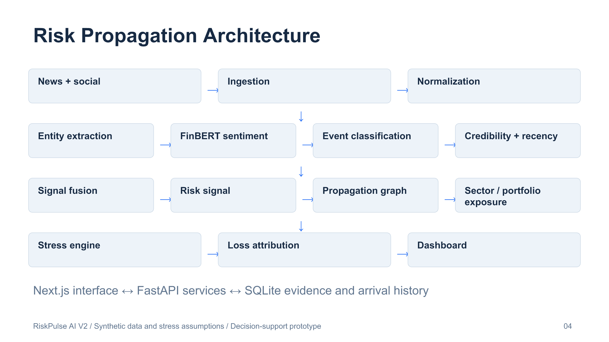

# RiskPulse AI - S&P Global & Crisil Campus Hackathon

Real-Time Financial Risk Intelligence & Portfolio Stress Testing

**Candidate Name:** Pending full candidate name  
**College Email ID:** Pending college email  
**College / Campus:** Pending college name  
**Demo Video Link:** Pending 10-minute YouTube Unlisted recording  
**Repository:** https://github.com/sahsudhanshu/SP  
**Slide Deck:** [Seven-slide PDF](docs/presentation.pdf) and [editable PPTX](docs/presentation.pptx)

## V2 upgrade: explainable portfolio risk intelligence

The current application adds source fusion, confidence/recency-adjusted priorities, an interactive financial transmission graph, scenario comparison and five what-if controls. The original V1 APIs, finance formulas and UI (at `/legacy`) remain available.

**Open:** http://127.0.0.1:3000 · **Risk map:** `/risk-map` · **Scenario lab:** `/stress-testing` · **Traceability:** `/audit` · **Measured diagnostics:** `/evaluation`.

V2 pages also include `/risk-feed`, `/portfolio`, `/timeline`, `/alerts`, and `/heatmap`. Clustering collapses the 24 synthetic fixture records into 12 events; copied social reports do not increase confidence. Sources and assumptions remain explicitly labelled. Confidence controls prioritization, not expected-loss probability.

**Verified:** 59 automated tests (original 25 retained), production build, local FinBERT inference, deterministic replay and V1 hero INR 100M → 97.1829688M. Hero: 2 sources / 1 distinct text, effective risk 8.3619 Critical, 12 asset paths, INR 42M direct / INR 59.5M weighted exposure. Intensity 1.5× gives INR 4.2255468M loss.

**Measured CPU diagnostics:** 24 synthetic records; event agreement 100%; sentiment agreement 91.67%; current NLP pipeline 22.073 ms/record. Controlled alternating-order benchmark: median sequential sentiment 24.833 ms/record versus batch-of-eight 20.713 ms/record. Rounded scores and labels match. Historical V1 timing is not a controlled comparator. See [metrics-v2.json](docs/metrics-v2.json) for timing scopes and caveats.

Run `python scripts/validate_data.py` (41 records checked, 12 expected copies, 0 invalid), `python scripts/run_demo.py` for the complete chain, and `python scripts/evaluate_v2.py` to remeasure locally. Use one backend worker. Tests use an isolated SQLite database and a labelled lexicon fallback; real-model evaluation runs separately.

New backend modules: `backend/v2.py`, `services/intelligence.py`, `services/propagation.py`, `services/scenario_analysis.py`. SQLite adds `RiskHistory` for actual arrival snapshots. Configure half-life, thresholds and source assumptions in `data/risk_config.json`.

Read the [V2 model/API specification](docs/v2-model-spec.md), [five differentiators](docs/technical-differentiators.md), [jury Q&A](docs/jury-qa.md), [audit plan](docs/v2-upgrade-plan.md), [five-minute pitch](docs/live-pitch-script.md) and [ten-minute recording script](docs/demo-script.md). The seven-slide presentation and architecture image have been updated for V2.

The sections below document the preserved V1 engine and original setup. Metrics in those sections are historical V1 measurements.

## 1. Project Overview / Problem Statement & Approach

Financial news and investor discussion arrive as unstructured text, while risk decisions require issuer, sector and portfolio context. RiskPulse AI converts text from two sources into structured signals and directly uses those signals to run synthetic portfolio scenario analysis.

The prototype implements the mandatory AI/NLP risk engine and Module B: strategic portfolio stress testing. It supports deterministic offline replay, optional live news with graceful fallback, an explanation of each impact component, issuer/sector exposure mapping, automatic stress tests for impact scores at least eight, and asset-level loss reconciliation.

All positions, issuers, source records, sensitivities and shocks are synthetic. The product supports explainable analyst triage and scenario comparison. It does not forecast market prices, provide calibrated loss probabilities, execute trades or use confidential information. AI assistance was used for implementation and documentation; the candidate should review and understand the full submission.

## 2. Architecture & Tech Stack



News and social CSV adapters feed cleaning, entity extraction, sentiment inference, TF-IDF event classification, business-rule impact scoring, exposure mapping, synthetic stress repricing and the dashboard. One FastAPI process and SQLite database serve one Next.js application. No cloud, broker, queue, GPU or external database is required.

| Layer | Implementation |
|---|---|
| Frontend | Next.js 15, React 19, TypeScript, Tailwind CSS 4, Recharts, Lucide icons |
| API | Python, FastAPI, Pydantic, Uvicorn, httpx |
| NLP | Hugging Face Transformers and CPU PyTorch for FinBERT; scikit-learn TF-IDF; financial lexicon fallback |
| Data | SQLite, CSV, JSON; Pandas available for data workflows |
| Verification | pytest, FastAPI TestClient, production frontend build, browser walkthrough |

`backend/services/nlp.py` implements replaceable sentiment, event and entity components. `backend/services/finance.py` isolates impact, exposure and stress calculations. `backend/store.py` manages six SQLite tables: NewsItem, SocialPost, RiskSignal, PortfolioAsset, StressScenario and StressTestResult. Each stores a typed JSON payload keyed by an ID. API requests have Pydantic validation.

## 3. Dataset Used

See [data documentation](data/README.md). The submitted files contain 12 synthetic news stories, 12 paired social posts, 12 portfolio assets worth INR 100M and five stress scenarios. Fictional news timestamps fall on 1 October 2026. Author-labelled expected events and sentiment are evaluation fields only; inference uses the text and portfolio. Social and news examples are correlated, not independent corroboration.

The synthetic portfolio includes corporate loans, government and corporate bonds, equities and derivatives across Energy, Technology, Financials, Healthcare, Consumer and Industrials. Derivatives use synthetic carrying values, with proportional repricing rather than notional-based pricing or Greeks. Rates and credit risk are simplified.

## 4. Quickstart & Installation

Tested on Windows with Python 3.14 and Node 22. Python 3.11+ and Node 20.9+ are the recommended starting points. All commands run from the repository root unless explicitly stated. First-time package installation and optional model download require internet; subsequent demo runs do not.

```powershell
git clone https://github.com/sahsudhanshu/SP.git
cd SP
python -m venv .venv
.\.venv\Scripts\python.exe -m pip install -r requirements.txt
.\.venv\Scripts\python.exe scripts/seed_data.py
cd frontend
npm install
cd ..
```

On this workstation an environment inheriting already installed packages was used, then missing/broken dependencies were installed inside `.venv`. For a reviewer, use the clean virtual environment above.

### Optional FinBERT preparation

```powershell
.\.venv\Scripts\python.exe scripts/download_model.py
```

This downloads `ProsusAI/finbert` once into `.models`. The running engine loads tokenizer and model once, reuses the pipeline and caches up to 512 text results. Startup uses local files only by default. FinBERT model weights remain outside Git; its published licence and model terms apply separately from this repository's MIT code licence.

### How to run backend

```powershell
.\.venv\Scripts\python.exe -m uvicorn backend.main:app --host 127.0.0.1 --port 8000
```

Backend health: http://127.0.0.1:8000/api/health  
Interactive API docs: http://127.0.0.1:8000/docs

For guaranteed lightweight fallback mode in a fresh terminal:

```powershell
$env:SENTIMENT_MODE='fallback'
.\.venv\Scripts\python.exe -m uvicorn backend.main:app --host 127.0.0.1 --port 8000
```

### How to run frontend

In a second terminal:

```powershell
cd C:\Users\Sudhanshu\Desktop\Projects\SP\frontend
npm run dev
```

For a cloned copy elsewhere use `cd frontend` from that copy. On this workstation, npm is not on PATH. The repository wrapper selects the bundled package manager: run `powershell -ExecutionPolicy Bypass -File scripts/frontend.ps1` from the project root. Use `-Action build` or `-Action install` for those operations. This process-scoped policy flag does not change the machine execution policy. Open http://127.0.0.1:3000. Production check: `npm run build`, then `npm start`. The frontend never substitutes invented data if the API is down; it shows a connection error and Retry.

On macOS/Linux use `python3 -m venv .venv`, `.venv/bin/python` in place of the Windows executable, and `SENTIMENT_MODE=fallback .venv/bin/python -m uvicorn backend.main:app --host 127.0.0.1 --port 8000` when needed. These operating systems were not tested here.

### Environment variables

Copy `.env.example` to `.env` if configuration is needed. Defaults work without a file or secret. Place frontend variables in `frontend/.env.local`; changing them requires restarting Next.js.

| Variable | Default | Meaning |
|---|---|---|
| NEWS_API_KEY | empty | Optional NewsAPI key; missing key uses demo fallback |
| MODEL_NAME | ProsusAI/finbert | Local finance sentiment model name |
| SENTIMENT_MODE | auto | `fallback` forces the lexicon; auto tries local FinBERT |
| ALLOW_MODEL_DOWNLOAD | 0 | `1` permits startup download; pre-download is preferable |
| HF_HOME | `.models` inside repository | Hugging Face cache location |
| DATABASE_URL | backend/database/riskpulse.db | SQLite file path, absolute or relative to repository |
| NEXT_PUBLIC_API_URL | http://127.0.0.1:8000 | Frontend API origin; configure in frontend/.env.local |
| IMPACT_WEIGHTS | internal documented defaults | JSON object with severity, sentiment, relevance, reliability, exposure; nonnegative values must sum to 1 |

No credentials are in source. The server binds to loopback and is intended for local use; authentication and production deployment hardening are outside the prototype scope.

### API endpoints

| Method | Path | Behavior |
|---|---|---|
| GET | /api/health | Availability, active sentiment mode and model-load failure reason |
| POST | /api/analyze | Analyze `text`, optional `source_type`, `source`, `headline`; persist signal and auto stress if threshold crossed |
| GET | /api/risk-feed | Processed signals with scoring evidence and source provenance |
| GET | /api/portfolio | Assets and computed total portfolio value |
| GET | /api/portfolio/exposure | `signal_id` maps one signal; omission returns hypothetical broad event sensitivity exposure |
| GET | /api/scenarios | Submitted synthetic assumptions |
| POST | /api/stress-test | `signal_id`, optional matching `scenario_id`, intensity between 0.1 and 2 |
| GET | /api/stress-tests | Persisted manual and automatic results |
| GET | /api/statistics | Counts, mean impact, processing latency and record-order trend |
| POST | /api/demo/next | Process the next deterministic source record |
| POST | /api/demo/reset | Clear runtime signals/results and process six ordinary initial records |
| POST | /api/ingest/live | Optional NewsAPI; missing key, unusable response or outage falls back to demo |

Example analysis body:

```json
{"text":"Severe geopolitical war and shipping blockade threatens Helios Energy oil supply. Sanctions cause crisis and disruption in India.","source_type":"news"}
```

### NLP pipeline and impact scoring

1. Remove URLs/HTML and normalize whitespace.
2. Extract issuer matches from actual portfolio names, countries, instruments and sectors using transparent dictionaries.
3. FinBERT returns class probabilities. Signed sentiment = P(positive) - P(negative). The financial lexicon fallback handles weighted positive/negative terms and nearby negation. Its confidence is heuristic evidence strength, never a model probability.
4. Classify GEOPOLITICAL, MACROECONOMIC, CREDIT_EVENT, MERGER_ACQUISITION, PRODUCT_LAUNCH or OTHER using TF-IDF similarity to category descriptions plus phrase weights. Event confidence and combined confidence are uncalibrated evidence strength.
5. Compute `impact = 1 + 9 × Σ(weight × factor)`, clamped to 1–10. Weights: severity .45, sentiment magnitude .20, relevance .10, assumed source reliability .10, exposure .15. Severity is event-specific and rises for severe terms. Reliability is .85 news / .55 social. Exposure factor = min(1, 2 × weighted exposure fraction). The API returns weights, factors and point contributions. This is a prioritization score, not a calibrated market-loss probability.

Source reliability depends on source type as a hackathon assumption; it is not verified credibility. Dictionary extraction can miss entities or match broad terms. OTHER events can be analyzed but have no automatic scenario.

### Exposure mapping and stress logic

Mapping weights: issuer match 1.0, sector match 0.8, systemic spillover 0.35 for geopolitical/macro events, otherwise zero. A position receives one highest-priority match. Direct exposure sums issuer/sector matched values. Weighted exposure sums value × mapping weight. High-sensitivity exposure sums mapped positions with sensitivity ≥ .70.

`asset loss = -value × shock × (impact / 10) × intensity × mapping weight × event sensitivity`

Applied shocks are capped to [-100%, +100%]. For macro bond repricing, total shock includes `-duration × yield shift`, with a synthetic +2 percentage point yield shift. Portfolio after = baseline − sum(asset losses); sector losses and top contributors derive from those same asset-level results. Positive shocks can create negative loss (gain). The intensity slider recalculates values. Signal classification selects the matching scenario; incompatible event/scenario combinations are rejected.

Impact ≥ 8 triggers and persists an automatic test. The dashboard can load that result or run a manual intensity comparison. Each scenario remains labelled **Synthetic hackathon stress assumptions**.

## 5. Key Results & Domain Impact

Actual local diagnostics are in [metrics.json](docs/metrics.json). FinBERT evaluation on 24 synthetic records measured 100% event-label agreement, 91.67% sentiment-label agreement and approximately 27.4 ms mean pipeline latency. Paired news/social texts share vocabulary with the rules. These figures do not demonstrate generalization. Startup/model loading is excluded, repeated-text caching affects the mean, and hardware/runtime affects timings.

The FinBERT geopolitical hero run computed impact 9.78, baseline INR 100M, after INR 97.183M, loss INR 2.817M (2.817%). Source text also mentions shipping, so Energy and Industrials are mapped. Direct exposure is INR 42M, weighted exposure INR 59.5M, and high geopolitical sensitivity exposure INR 28M. These are computed outputs, not prescribed target numbers.

The conceptual domain impact is quicker traceability between financial text and portfolio assumptions: an analyst can review NLP provenance, explain priority, inspect exposed positions and compare scenario intensity. No quantified efficiency improvement or calibrated forecasting performance is claimed.

### Demo instructions

Open Overview, press Reset demo, inspect initial records, press Next event once, open Event Intelligence, and Run stress test. Review before/after, sector and asset contributions; adjust multiplier and rerun. Explore Portfolio and Scenarios. Use Risk Feed to filter sources or analyze new text. Replay processes the next record every seven seconds while enabled and stops at dataset end. Polling refreshes the dashboard every five seconds. Duplicate paired-source events remain separate signals and are not aggregated as independent evidence. The displayed mean risk score summarizes signals and is not a statistical portfolio risk measure.

Command-line hero: `python scripts/run_demo.py` while backend is running.

### Tests and evaluation

```powershell
$env:PYTEST_DISABLE_PLUGIN_AUTOLOAD='1'
.\.venv\Scripts\python.exe -m pytest backend/tests -q
.\.venv\Scripts\python.exe scripts/evaluate.py
cd frontend
npm run build
```

25 automated tests pass, including sentiment fallback behavior and transformer output formats, five event labels/OTHER, normalization, extraction, portfolio totals, exposure, configurable impact, hand-calculated stress losses/gains, duration repricing, API routes and malformed requests, missing-key/outage fallback, replay completion, and the text-to-exposure-to-stress end-to-end flow. Tests isolate SQLite in `work/test.db` and force fallback to remain offline; actual FinBERT inference was separately exercised in evaluation.

### Limitations and future work

This is a local individual prototype, not a production risk platform. No spaCy dependency is needed for the dictionary entity implementation. Event and impact scores are transparent heuristics, not a trained severity or calibrated default model. Shock assumptions, mapping weights and sensitivities are synthetic. Derivatives use proportional carrying-value changes; there is no netting, hedging, Monte Carlo, liquidity adjustment or nonlinear instrument valuation. Portfolio valuation is static, not a live price feed. The replay progresses while the dashboard is active, not as an unattended scheduler. Live NewsAPI success depends on a valid user key; its failure path was tested, and social input remains local synthetic data.

Future work: independent finance-labelled evaluation, trained event classification, broader entity NER, empirical shock calibration, instrument-specific pricing, source provenance controls and portfolio governance validation.

### Submission materials and audit

- [Architecture image](docs/architecture.png)
- [Seven-slide presentation](docs/presentation.pdf)
- [Five-minute jury script](docs/live-pitch-script.md)
- [Ten-minute recording script](docs/demo-script.md)
- [Submission audit](docs/submission-audit.md)
- [Dataset documentation](data/README.md)

Before submitting, fill the candidate metadata above and on slide 1, record/upload the YouTube walkthrough, verify this GitHub repository is public, confirm the final code has been pushed, and test both repository and video access in an incognito window. The official preferred repository naming is `<college>-<candidate-name>-hackathon`; the user explicitly selected the existing `SP` repository for this implementation.

